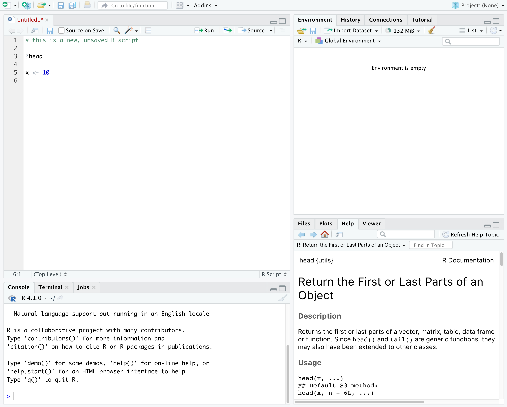
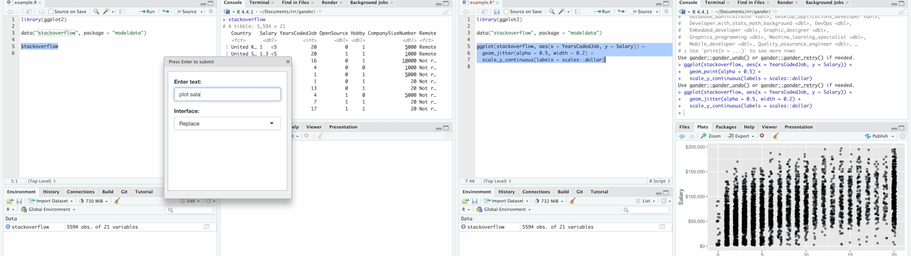
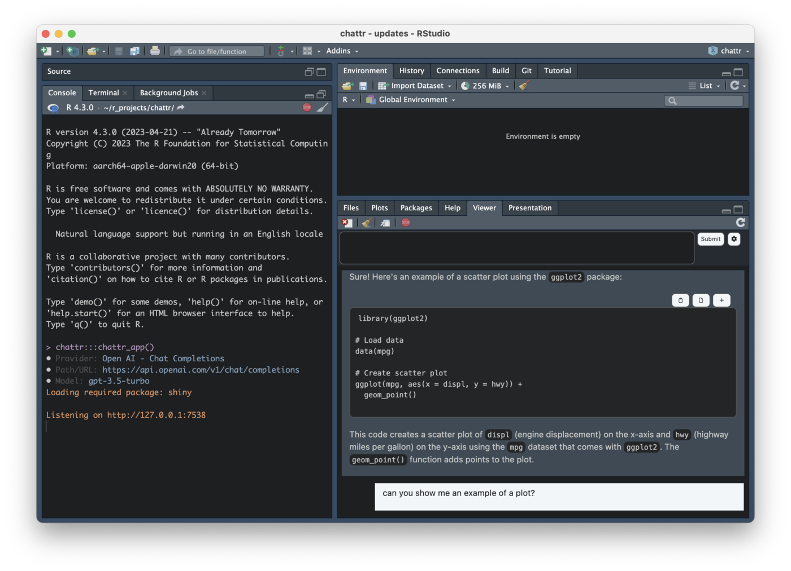

::: {.notes}
Use the one-hour block without compressing the operational foundation. The
operational sections are participatory demonstrations in RStudio. The slides
are cues and a static fallback, not a replacement for the live work.

Source: https://datacarpentry.github.io/R-ecology-lesson/instructor/introduction-r-rstudio.html
:::

## By the end

You should be able to:

1. distinguish **R** from **RStudio**;
2. locate where code, results, objects, files and help appear;
3. recognize common R values, vectors and tibble structure;
4. use an R Project and a Quarto document to leave work that runs again.

::: {.notes}
State these as practical outcomes rather than a list of terminology. Students
will demonstrate each outcome during the code-along.

Ask: Which program actually runs the code—R or RStudio? Take two or three
answers without correcting them yet.
:::

## R and RStudio are different

:::: {.columns}

::: {.column width="48%"}
### R

- a programming language
- software that executes R code
- available with or without RStudio
:::

::: {.column width="48%"}
### RStudio

- an integrated development environment
- an editor and interface for working with R
- also works with files, plots, help and projects
:::

::::

::: {.notes}
Answer the opening question: R runs the code. RStudio provides the working
interface and launches an R session.

Keep this distinction precise because it helps with troubleshooting: an R
problem, an RStudio problem and a package problem are not interchangeable.

Source: https://datacarpentry.github.io/R-ecology-lesson/instructor/introduction-r-rstudio.html#what-are-r-and-rstudio
:::

## R answers the command you gave it

R evaluates code literally.

- A malformed command may produce an **error**.
- A questionable operation may produce a **warning**.
- A valid command may produce an answer to the wrong question.

::: {.callout-note}
Code that runs is not evidence that the intended analysis was performed.
:::

::: {.notes}
Use the shortened “pedantic collaborator” framing from Data Carpentry. Do not
perform the full story. R does not know the biological question unless it is
represented in the data and commands.

Ask: Which of the three responses proves that the scientific question was
answered correctly? Answer: none of them.

Source: https://datacarpentry.github.io/R-ecology-lesson/instructor/introduction-r-rstudio.html#why-learn-r
:::

## The RStudio workspace

{fig-alt="RStudio showing the Source pane at upper left, Environment at upper right, Console at lower left, and Files, Plots, Help and Viewer at lower right." width="82%" fig-align="center"}

Where would you edit code, see an answer, inspect an object and open help?

::: {.notes}
Pause before naming the panes. Ask learners to point or answer verbally.

The screenshot is reproduced from Data Carpentry under CC BY 4.0. It shows an
older RStudio release, but the four-pane organization and roles remain current.

Source: https://github.com/datacarpentry/R-ecology-lesson/blob/main/episodes/fig/rstudio_screenshot.png
License: https://creativecommons.org/licenses/by/4.0/
:::

## Four panes, four jobs

| Pane | Main job |
|---|---|
| **Source** | Edit and preserve scripts and Quarto documents |
| **Console** | Execute code and show immediate responses |
| **Environment / History** | Inspect objects in the current session and recent commands |
| **Files / Plots / Help / Viewer** | Navigate files and inspect results or documentation |

The arrangement can change. The jobs do not.

::: {.notes}
Keep this to orientation. Do not tour every tab or preference.

Formative check: name a task and ask for the pane—for example, “Where would I
look for the arguments to mean()?”
:::

## In RStudio now

Find these four places in your own window:

1. Source
2. Console
3. Environment
4. Files and Help

Then return your attention to the front.

::: {.notes}
Move to the real RStudio window. Enlarge the interface and share the whole
screen so project dialogs are visible. Allow learners to locate the panes, but
do not customize layouts.

Target: 4–6 minutes including questions.
:::

## A Project gives the analysis a root

```text
BIOSCI504/
├── BIOSCI504.Rproj
├── _quarto.yml
├── README.md
└── exercises/
```

Open `BIOSCI504.Rproj` before beginning course work.

::: {.notes}
An R Project identifies the top-level directory for the work. Files beneath it
can be referred to relative to this common root.

Source: https://datacarpentry.github.io/R-ecology-lesson/instructor/introduction-r-rstudio.html#getting-set-up-in-rstudio
:::

## Create the course Project once

If you have not already created it:

```r
BIOSCI504::create_course_project("~/BIOSCI504")
```

Then open `BIOSCI504.Rproj` in RStudio.

::: {.callout-important}
Creating the `.Rproj` file does not open it for you.
:::

::: {.notes}
Demonstrate this once. Do not ask learners who already have the Project to
recreate it. On Windows, `~` refers to the user's home directory.

Show the project indicator in the top-right corner after opening the file.

Package documentation: https://cohmathonc.github.io/BIOSCI504/reference/create_course_project.html
:::

## Add the Lecture 2 code-along

From inside the course Project:

```r
BIOSCI504::copy_template("lecture-2")
```

Open:

```text
exercises/working-with-r/analysis.qmd
```

::: {.notes}
Students should run the copy command and open the resulting document. If the
destination already exists, they should open it rather than overwrite their
work.

This is a guided code-along, not the tabular-data exercise. Lecture 3 uses the
`lecture-3` template.

Package documentation: https://cohmathonc.github.io/BIOSCI504/reference/copy_template.html
:::

## Relative paths describe relationships

Machine-specific:

```text
C:/Users/Alex/Documents/BIOSCI504/exercises/working-with-r/analysis.qmd
```

Relative to the Project:

```text
exercises/working-with-r/analysis.qmd
```

Which path can survive a different username or computer?

::: {.notes}
Pause for the answer. The second path expresses the file's relationship to the
Project rather than its location on Alex's computer.

Do not demonstrate `setwd()`. Explain that opening the Project establishes the
working context and avoids paths embedded for one machine.

Supplement: https://swcarpentry.github.io/r-novice-gapminder/instructor/02-project-intro.html
:::

## Inputs, instructions and products

| Keep unchanged | Preserve and edit | Regenerate |
|---|---|---|
| raw observations | scripts and `.qmd` files | figures |
| metadata | analytical decisions | tables |
| data dictionaries | explanations | rendered HTML |

Generated output should be traceable to recorded instructions.

::: {.notes}
This adapts the Carpentries project organization without asking learners to
build an unrelated ecology directory tree. Emphasize that raw inputs remain
unchanged and derived products can be recreated.
:::

## The Environment is temporary

The course Project sets:

```text
RestoreWorkspace: No
SaveWorkspace: No
```

Restarting R clears session objects. It does not remove saved files.

::: {.notes}
Point to the Environment pane, then restart R during the demonstration. The
empty Environment is expected.

The package writes these settings into `BIOSCI504.Rproj`. This makes hidden
workspace state less likely to make incomplete code appear successful.
:::

## Console and document

:::: {.columns}

::: {.column width="48%"}
### Console

```text
> 2 + 2
[1] 4
```

Immediate interaction with R.
:::

::: {.column width="48%"}
### Quarto document

```r
# saved inside an R code chunk
2 + 2
```

An executable record.
:::

::::

::: {.notes}
Move to the code-along document. Ask learners to run `2 + 2` first in the
Console and then from the Quarto chunk.

Both are executed by R. Only the command in the document is already organized
as part of the analysis record. On Windows, demonstrate `Ctrl+Enter` to send
the current line from the Quarto chunk to the Console.

Source: https://datacarpentry.github.io/R-ecology-lesson/instructor/introduction-r-rstudio.html#console-vs-script
:::

## The Console is a REPL

**R**ead → **e**valuate → **p**rint → **l**oop

```text
> 2 + 2
[1] 4
>
```

- `>` is ready for an expression.
- `[1]` marks the first displayed element.
- The next `>` begins the loop again.

::: {.notes}
Name the read-evaluate-print loop explicitly. R reads the expression, evaluates
it, prints a visible result and returns a prompt for the next expression.

Then type an incomplete expression:

```text
> 1 +
+
```

The `+` is a continuation prompt, not a result. Press Escape to cancel and
recover the `>` prompt. This is useful when a missing parenthesis or quote
leaves the Console waiting.

Source: https://swcarpentry.github.io/r-novice-gapminder/instructor/01-rstudio-intro.html#introduction-to-r
:::

## Common atomic storage types

| Expression | Type | Meaning here |
|---|---|---|
| `18.2` | double | numerical measurement |
| `18L` | integer | whole number marked with `L` |
| `"M01"` | character | quoted text |
| `TRUE` | logical | true or false |

Check with `typeof()`.

::: {.notes}
Run `typeof(18.2)`, `typeof(18L)`, `typeof("M01")` and `typeof(TRUE)` in the
code-along. Ask for a prediction before each result.

R often uses “numeric” as a broader description of numerical values; ordinary
numbers are normally stored as doubles. Use R's term “character,” while noting
that students may know a character value as a string. Complex and raw complete
R's six atomic storage types, but neither is needed in this analysis.

Source: https://swcarpentry.github.io/r-novice-gapminder/instructor/04-data-structures-part1.html#data-types
R reference: https://stat.ethz.ch/R-manual/R-devel/library/base/html/typeof.html
:::

## Missing values retain a type

| Expression | `typeof()` | Meaning |
|---|---|---|
| `NA` | logical | missing value, default type |
| `NA_integer_` | integer | missing integer |
| `NA_real_` | double | missing measurement |
| `NA_character_` | character | missing text |

```r
is.na(c("M01", NA_character_, "NA"))
# FALSE  TRUE FALSE
```

`NA_character_` is missing. `"NA"` is text.

::: {.notes}
Run all five typed missing constants in the code-along, including
`NA_complex_`. Bare `NA` is logical. R has no `NA_raw_` because raw vectors do
not support missing values.

Emphasize the predicate: do not test missingness with `x == NA`. A character
missing value and the literal letters “NA” are different data states.

Source: https://stat.ethz.ch/R-manual/R-devel/library/base/html/NA.html
:::

## Atomic vectors hold one underlying type

```r
weights_g <- c(18.2, 19.5, 20.1)
typeof(weights_g)
length(weights_g)
mean(weights_g)
```

1. `c()` combines values into a vector.
2. `<-` assigns that vector to `weights_g`.
3. `length()` and `mean()` receive the vector as an argument.

Predict the result before running the chunk.

::: {.notes}
This is recognition, not a syntax drill. Type and narrate the first line, run
it, inspect the Environment, then type and run the second line.

Ask for predictions before execution: type `double`, length 3, then a mean near
19 g. The exact mean, 19.2667 g, is less important than tracing value, type,
object, function and argument.

An atomic vector has one underlying type. Hold coercion until the warning
example rather than expanding it here.

Source: https://swcarpentry.github.io/r-novice-gapminder/instructor/04-data-structures-part1.html#vectors-and-type-coercion
:::

## A tibble contains column vectors

```r
measurements <- tibble(
  mouse_id = c("M01", "M02", "M03"),
  weight_g = weights_g
)

glimpse(measurements)
typeof(measurements)
class(measurements)
```

```text
Rows: 3
Columns: 2
$ mouse_id <chr> "M01", "M02", "M03"
$ weight_g <dbl> 18.2, 19.5, 20.1
```

Each column is a vector. All columns have the same length.

::: {.notes}
Point out the tibble object, its two named column vectors and their types.
`<chr>` means character and `<dbl>` means double. Rows are observations;
columns are variables. Do not begin data manipulation here.

`typeof(measurements)` is `"list"`; `class(measurements)` includes `"tbl_df"`,
`"tbl"` and `"data.frame"`. Type describes storage. Class helps determine how
functions interpret the object. This is recognition only, not an introduction
to object-oriented programming.

The code-along loads tidyverse before this chunk, making `tibble()` available.
Use `glimpse()` because it makes structure and types visible. `str()` is the
base-R counterpart used in the Carpentries source.

Source: https://swcarpentry.github.io/r-novice-gapminder/instructor/04-data-structures-part1.html#data-structures
R references:
https://stat.ethz.ch/R-manual/R-devel/library/base/html/typeof.html
https://stat.ethz.ch/R-manual/R-devel/library/base/html/class.html
:::

## Missing, undefined, infinite or absent?

| Value | Description | Detect with |
|---|---|---|
| `NA` | unknown or missing value | `is.na()` |
| `NaN` | undefined numerical result | `is.nan()` |
| `Inf`, `-Inf` | infinite numerical result | `is.infinite()` |
| `NULL` | absence; length zero | `is.null()` |

`is.finite()` is false for `NA`, `NaN` and both infinities.

::: {.notes}
Run the `special_values` tibble in the code-along. Ask students to compare the
predicate columns rather than memorize the table. `NaN` is also detected by
`is.na()`, but an ordinary `NA` is not a `NaN`. Infinities are not missing.

Then show `typeof(NULL)`, `length(NULL)` and `is.null(NULL)`. `NULL` is not a
missing element in a vector; it commonly represents the absence of a value or
result.

Sources:
https://stat.ethz.ch/R-manual/R-devel/library/base/html/is.finite.html
https://stat.ethz.ch/R-manual/R-devel/library/base/html/NULL.html
:::

## Removing a missing value changes the calculation

```r
weights_with_missing <- c(18.2, NA_real_, 20.1)

mean(weights_with_missing)
# [1] NA

mean(weights_with_missing, na.rm = TRUE)
# [1] 19.15
```

How many observations contribute to the second mean?

::: {.notes}
The second mean uses two observations. `na.rm = TRUE` is an explicit analytical
choice, not a routine repair. Ask what would justify excluding the missing
measurement and what should be reported about it.

This is the first small example of a recurring course rule: missing-data
handling belongs in the analysis specification and the executable record.

Source: https://stat.ethz.ch/R-manual/R-devel/library/base/html/mean.html
:::

## Packages and help

```r
library(tidyverse)
?mean
```

- `library()` attaches an installed package for the current session.
- `?mean` opens the help page for `mean()`.
- Help records arguments, returned values and examples.

::: {.notes}
Open the `mean()` help page in the Help pane. Point to Usage, Arguments and
Value. Learners do not need to remember every argument; they need to know where
the contract is documented.

Do not install packages during this lecture.
:::

## Read the response before editing

```r
mean(weight_g)
```

```text
Error: object 'weight_g' not found
```

Compare:

```r
weights_g
measurements$weight_g
```

::: {.notes}
Have learners run the deliberate error in the Console. `weight_g` is neither
the standalone object `weights_g` nor an automatic reference to the column.
The column lives inside `measurements`; `$` makes that relationship explicit.

Run `names(measurements)`, then `measurements$weight_g`. Both `weights_g` and
`measurements$weight_g` contain the same values here, but they are different
expressions that locate those values differently.

Normalize errors as useful information without claiming that every message is
easy to interpret.
:::

## One value can change a vector's type

```r
mixed_weights <- c(18.2, 19.5, "20.1")
typeof(mixed_weights)
mean(mixed_weights)
```

```text
[1] "character"
[1] NA
Warning message:
In mean.default(mixed_weights) :
  argument is not numeric or logical: returning NA
```

The code ran. Is its output usable?

::: {.notes}
Ask learners to predict the type before running the code. Because an atomic
vector has one type, the quoted value causes every element to be stored as
character. `mean()` completes but warns and returns `NA`.

This is a compact example of why inspecting types is scientific work: a single
data-entry or import problem can change the representation of an entire
column. Do not expand into a complete coercion hierarchy.
:::

## Error, warning, output

| Response | What it establishes |
|---|---|
| **Error** | The requested operation did not complete |
| **Warning** | The operation completed, but a condition needs attention |
| **Output** | The code ran and returned something |

None establishes that the scientific question and analysis match.

::: {.notes}
Correct the common overstatement that warnings are harmless. A warning should
be read and understood in context.

Ask again: which response proves the intended analysis is correct? The answer
remains none. Verification requires inspecting the data, transformations and
outputs against the specification.
:::

## Restart and render

1. Save `analysis.qmd`.
2. Select **Session > Restart R**.
3. Confirm that the Environment is empty.
4. Select **Render**.

If it renders, the document contains the code needed to reconstruct its output.

::: {.notes}
Learners perform the four steps. Rendering the whole document is the formative
assessment: it checks the R session, Quarto, packages, object order and saved
record together.

If an individual machine fails, pair the learner with a neighbor and capture
the exact error for the break. Do not consume the next session troubleshooting
one workstation.

Quarto tutorial: https://quarto.org/docs/get-started/hello/rstudio.html
:::

## Working method for this course

1. State the question and prediction.
2. Specify what the analysis should do.
3. Write or generate a small section of code.
4. Run it and inspect the result.
5. Preserve the working step in the document.
6. Restart, render and verify before interpreting.

::: {.notes}
Connect this sequence to Lecture 1 without repeating the AI survey. Chat may
help produce or explain code, but the executable document is the course record.

Ask: after a useful exchange in Teams Copilot, where should the successful code
and reasoning go? Answer: into the Quarto document, followed by execution and
inspection.
:::

## AI interfaces can sit closer to the analysis

| Interface | Context supplied to the model |
|---|---|
| Teams Copilot | text, code and errors that you paste into chat |
| `gander` / `chattr` | selected editor content or RStudio context |
| `ellmer` | context assembled programmatically in R |
| coding agents | project files, terminal commands and tool results |

Closer integration changes what context can be supplied and where the result
appears. It does not decide whether the analysis is scientifically appropriate.

For any interface, ask:

1. What can it see?
2. Which service receives the data?
3. How will the returned code be checked?

::: {.notes}
These packages are examples of closer integration, not course installation
requirements or recommendations. Use this slide as a map before showing what
two of the workflows actually look like.

`gander` supports context-aware code editing in RStudio. `chattr` provides chat
interfaces and IDE integrations. `ellmer` is the programmatic provider layer
used by tools including `gander` and `chattr`.

Coding agents such as Codex or Claude Code can operate across a project rather
than one pasted exchange. Lecture 1 surveyed that layer; do not repeat it here.

Sources:
https://simonpcouch.github.io/gander/
https://mlverse.github.io/chattr/
https://ellmer.tidyverse.org/

Reinforce the standing data-governance rule: know where data is going before
sending it. Course exercises use the institutionally provided Teams Copilot;
students are not expected to have API access.
:::

## `gander` edits the document in front of you

{fig-alt="Two RStudio screenshots from the gander documentation. In the first, a selected object and a short request are supplied to the addin. In the second, inserted ggplot2 code is selected and its plot is visible." width="92%" fig-align="center"}

Select context → describe a change → inspect inserted code → run or revise

::: {.notes}
Narrate the two stages, then use the arrow sequence below them. The user selects
content in an RStudio source document, invokes the addin, states a change,
receives code directly in the document, inspects and runs it, and can select
that result for another revision.

The useful difference from a blank chat is the supplied context: `gander` can
include nearby source and descriptions of relevant R objects. By default,
relevant data-frame context can include values as well as names and types. The
configured model provider receives that context, so this is not inherently a
local or institutionally approved workflow. `gander_peek()` can expose the
assembled prompt.

`gander` is experimental. It is shown because the interaction pattern is
instructive, not because students should install it for this course.

Visual: stills derived from the screencast embedded in Simon Couch's official
`gander` documentation. The attachment has no separate licence metadata; it is
credited and linked here. The surrounding source repository is MIT licensed;
its notice is retained in `assets/gander-LICENSE.md`.

Sources:
https://simonpcouch.github.io/gander/
https://simonpcouch.github.io/gander/articles/gander.html
https://simonpcouch.github.io/gander/reference/gander_peek.html
:::

## Chat beside the analysis—or call the model from R

:::: {.columns}

::: {.column width="48%"}
### `chattr`

{fig-alt="RStudio with a chattr conversation open in the Viewer pane. The response contains R code and controls for copying it." width="100%"}

Viewer chat with analysis context; preview the request and move returned code
into the document.
:::

::: {.column width="48%"}
### `ellmer`

```r
chat <- ellmer::chat_ollama()

chat$chat(
  "Explain this warning in one sentence"
)
```

R constructs the conversation and receives the result. It can also request
structured values or register tools.
:::

::::

::: {.notes}
Explain why an interested student might investigate these interfaces.
`chattr` is a short step from web chat: the conversation remains visible in the
Viewer, but the request can include analysis context and generated code can be
moved into the current document. `chattr(preview = TRUE)` makes the assembled
request inspectable.

`ellmer` is a programmatic interface. An R object holds a stateful conversation;
R can receive the response as a value rather than relying on copy and paste.
That enables repeated or structured tasks and tool calling. Structured output
constrains form, not scientific truth: a model can still supply an unsupported
value.

`chat_ollama()` illustrates a local provider, not a course requirement. Other
constructors use hosted services. In either case, inspect what is sent and test
what returns. `chattr` is also labelled experimental.

Visual: `chattr` authors, official package documentation, MIT licence. See
`assets/chattr-LICENSE.md` in the slide source.

Sources:
https://mlverse.github.io/chattr/
https://ellmer.tidyverse.org/
https://ellmer.tidyverse.org/articles/structured-data.html
https://ellmer.tidyverse.org/articles/tool-calling.html
:::

## Next: what does the table represent?

You now have:

- a Project that locates the work;
- a Quarto document that records it;
- a clean-render test that checks whether it can run again.

Next we examine what the rows, columns and measurements mean.

::: {.notes}
This is the transition to Lecture 3, not a preview of its solution. Do not open
or analyze `mouse_trial` here.
:::

## Questions

Then take a short break.

::: {.notes}
Take questions and the announced break when the teaching sequence concludes.
The expanded R foundation fits the one-hour block; do not remove earlier
Project or reproducibility material merely to preserve the draft's original
minute-by-minute estimate.
:::

# Further reading {.smaller}

- [Data Carpentry: Introduction to R and RStudio](https://datacarpentry.github.io/R-ecology-lesson/instructor/introduction-r-rstudio.html)
- [Software Carpentry: Introduction to R and RStudio](https://swcarpentry.github.io/r-novice-gapminder/instructor/01-rstudio-intro.html)
- [Software Carpentry: Data Structures](https://swcarpentry.github.io/r-novice-gapminder/instructor/04-data-structures-part1.html)
- [Software Carpentry: Project Management With RStudio](https://swcarpentry.github.io/r-novice-gapminder/instructor/02-project-intro.html)
- [The Carpentries: Live Coding is a Skill](https://carpentries.github.io/instructor-training/instructor/17-live.html)
- [Quarto in RStudio](https://quarto.org/docs/get-started/hello/rstudio.html)
- [`gander`: context-aware code editing](https://simonpcouch.github.io/gander/)
- [`chattr`: chat inside RStudio](https://mlverse.github.io/chattr/)
- [`ellmer`: programmatic LLM conversations in R](https://ellmer.tidyverse.org/)
- [`BIOSCI504` package](https://github.com/cohmathonc/BIOSCI504)

Portions adapted from *Data Analysis and Visualization in R for Ecologists*,
The Carpentries, [CC BY 4.0](https://creativecommons.org/licenses/by/4.0/).
Adapted for BIOSCI 504; no endorsement is implied.

::: {.notes}
The RStudio screenshot is reproduced from the same Data Carpentry lesson under
CC BY 4.0. This slide and the README provide visible attribution for the shared
student copy.
:::
